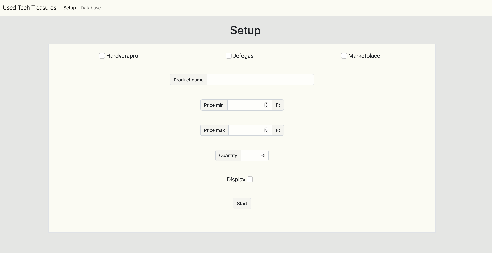
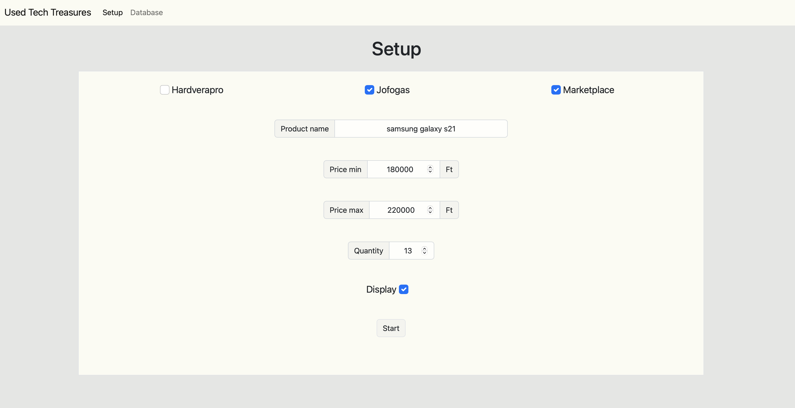
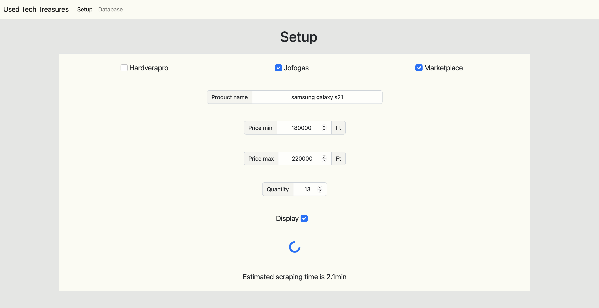
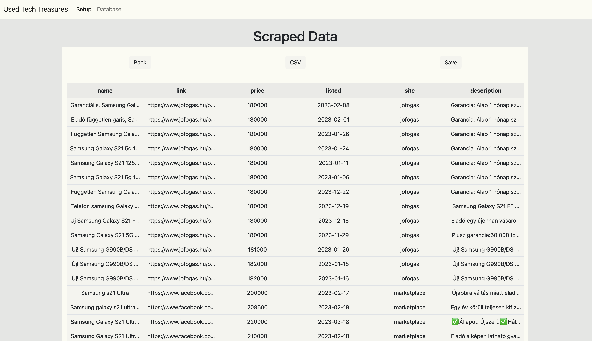
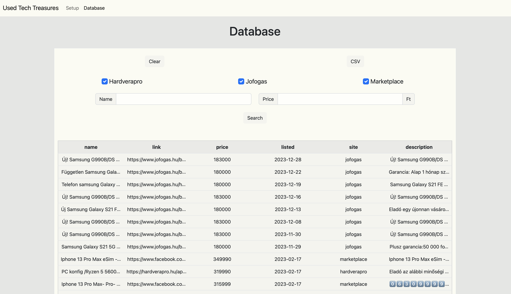
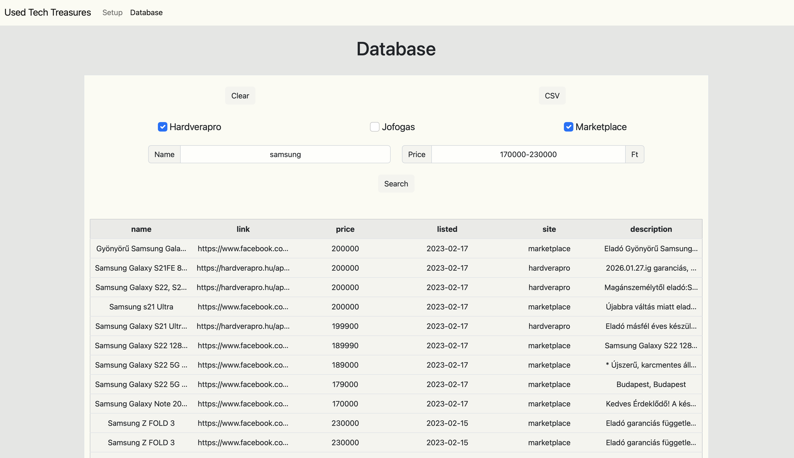

# UsedTechTreasures 
A Python web scraper that searches the top three (hungarian) second-hand tech websites for a specified product. 
It was built using Flask, Selenium, JQuery, Bootstrap, and MySQL.

## Table of Contents
* [General Info](#general-information)
* [Technologies Used](#technologies-used)
* [Features](#features)
* [Screenshots](#screenshots)
* [Project Status](#project-status)
* [Room for Improvement](#room-for-improvement)

## General Information
- The prices of second-hand tech products can vary significantly across different websites, with some websites having more regular people and others having more professional sellers. The goal of this project is to help users find the best prices across three popular second-hand tech websites.
- As someone who frequently buys second-hand tech products, I created this program to help me stay up-to-date with current prices and to quickly find good deals. Additionally, I sometimes use it to buy products at a good price and resell them for a profit.

## Technologies Used
- Python - version 3.10
- Flask - version 2.2
- Selenium - version 4.8
- JQuery - version 3.6
- Bootstrap - version 5.2

## Features
- Scrape one or all three of the supported second-hand tech websites for a specified product, with the option to filter by price range and number of results to scrape
- Choose between displaying the scraped data on the website or automatically saving it to the database
- When display is choosed export the scraped data to a CSV file or save it to the database 
- On the database page, search the database for specific products from a specific website within a specified price range, with the option to export the search results to a CSV file or delete the records.

## Screenshots

## Project Status
Project is: considered complete, but I'm still working on it from time to time to add new features or make improvements

## Room for Improvement

Room for improvement:
- Enhance the hardverapro scraping process to reduce the frequency of errors
- Improve the speed of scraping
- Improve the handling of unexpected scraper errors
